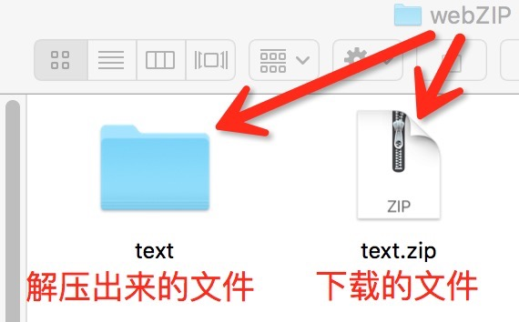

# webView加载与交互
***
第一次用MarkDown在git上发贴子，用的是Mou这个工具，觉得不错，推荐一下[Mou链接](http://25.io/mou/)，大家可以去参考一下使用！

下面进入正题
***
看一下需求
#####1.通过一个下载链接下载资源包，解压后再去加载
#####2.跟网页有交互，页面如下
 这个不好用到git上


***
实现思路

1.下载

2.解压

3.加载

4.交互
***
####下载
我们用的是基于***AFNetworking***封装的下载方法， 用***WebModel***调用
######接口
```objc
//
//  WebModel.h
//  git发贴专业测试
//
//  Created by Mac on 16/4/5.
//  Copyright © 2016年 Mac. All rights reserved.
//

#import <Foundation/Foundation.h>
#import <AFNetworking.h>
#import <UnzipKit.h>

@interface WebModel : NSObject
/**
 *  @author 嘴爷, 2016-04-05 15:04:25
 *
 *  @brief 测试专用，创建一个AFHTTPRequestOperationManager单例(中止下载时候使用)
 *
 *  @return AFHTTPRequestOperationManager单例
 */
+ (AFHTTPRequestOperationManager *)sharedInstance;

/**
 *  @author 嘴爷, 2016-04-05 16:04:53
 *
 *  @brief 根据url停止某个请求
 *
 *  @param url 待停止请求的特征url
 */
+ (void)kickOffOldMe:(NSString *)url;

/**
 *  @author 嘴爷, 2016-04-05 15:04:37
 *
 *  @brief 下载文件
 *
 *  @param paramDic   附加的请求参数
 *  @param requestURL 下载地址
 *  @param savedPath  保存路径
 *  @param success    下载成功的回调
 *  @param failure    下载失败的回调
 *  @param progress   实时下载进度
 */
+ (void)asyncDownloadWithParams:(NSDictionary *)param
                            url:(NSString*)url
                     savedPath:(NSString*)savedPath
               successBlock:(void (^)(AFHTTPRequestOperation *operation, id responseObject))successBlock
               errorBlock:(void (^)(AFHTTPRequestOperation *operation, NSError *error))errorBlock
                      progress:(void (^)(float progress))progress;


/**
 *  @author 嘴爷, 2016-05-03 09:05:04
 *
 *  @brief 解压文件
 *
 *  @param fromPath 待解压文件的位置
 *  @param toPath   解压到的位置
 *  @param progress 解压进度
 */
+(void)unArchiveFromPath:(NSString*)fromPath toPath:(NSString*)toPath progress:(void (^)(CGFloat percentDecompressed))progress;

/**
 *  @author 嘴爷, 2016-05-03 10:05:27
 *
 *  @brief 返回的绝对为字符串，不管是NULL nil  还是数字
 *
 *  @param string 待处理的对象
 *
 *  @return 字符串
 */
+ (NSString *) getBlankString:(id)string;

@end


```

######实现
```objc
//
//  WebModel.m
//  git发贴专业测试
//
//  Created by Mac on 16/4/5.
//  Copyright © 2016年 Mac. All rights reserved.
//

#import "WebModel.h"
#import <AFHTTPRequestOperationManager.h>
#import <AFURLRequestSerialization.h>

@implementation WebModel

//下载
+(void)asyncDownloadWithParams:(NSDictionary *)param url:(NSString *)url savedPath:(NSString *)savedPath successBlock:(void (^)(AFHTTPRequestOperation *, id))successBlock errorBlock:(void (^)(AFHTTPRequestOperation *, NSError *))errorBlock progress:(void (^)(float))progress{
    
//    下载前停止当前的下载
    [self kickOffOldMe:url];
    
    AFHTTPRequestSerializer* serializer = [AFHTTPRequestSerializer serializer];
    NSMutableURLRequest* request = [serializer requestWithMethod:@"GET" URLString:url parameters:param error:nil];
    
    AFHTTPRequestOperation* operation = [[AFHTTPRequestOperation alloc] initWithRequest:request];
//    加入到一个全局的队列  为了便于管理
    [[WebModel sharedInstance].operationQueue addOperation:operation];
    
    [operation setOutputStream:[NSOutputStream outputStreamToFileAtPath:savedPath append:NO]];
    [operation setDownloadProgressBlock:^(NSUInteger bytesRead, long long totalBytesRead, long long totalBytesExpectedToRead) {
        float p = (float)totalBytesRead / totalBytesExpectedToRead;
        if (progress) progress(p);
        
    }];
    
    [operation setCompletionBlockWithSuccess:^(AFHTTPRequestOperation * _Nonnull operation, id  _Nonnull responseObject) {
        if(successBlock) successBlock(operation, responseObject);
    } failure:^(AFHTTPRequestOperation * _Nonnull operation, NSError * _Nonnull error) {
        if(errorBlock) errorBlock(operation, error);
    }];
    
    [operation start];
}

//解压
+(void)unArchiveFromPath:(NSString*)fromPath toPath:(NSString*)toPath progress:(void (^)(CGFloat percentDecompressed))progress{
    //    下载之前删除之前的目标文件
    NSError* fileError = nil;
    NSFileManager* fm = [NSFileManager defaultManager];
    if ([fm fileExistsAtPath:toPath]) {
        [fm removeItemAtPath:toPath error:&fileError];
        NSLog(@"删除之前的目标文件%@", fileError);
    }
    
    
    BOOL fileAtPathIsArchive = [UZKArchive pathIsAZip:fromPath];//判断是否是zip文件
    if (!fileAtPathIsArchive) {
        return;
    }
    
    NSError *archiveError = nil;
    UZKArchive* archive = [[UZKArchive alloc] initWithPath:fromPath error:&archiveError];
    [archive extractFilesTo:toPath overwrite:YES progress:^(UZKFileInfo * _Nonnull currentFile, CGFloat percentArchiveDecompressed) {
        if(progress) progress(percentArchiveDecompressed);
        NSLog(@"解压进度%f", percentArchiveDecompressed);
    } error:&archiveError];
    
    //    解压完成后删除这个zip包
    NSError* deleteError = nil;
    if ([fm fileExistsAtPath:fromPath]) {
        //        [fm removeItemAtPath:fromPath error:&deleteError];
        [archive deleteFile:fromPath error:&deleteError];
        NSLog(@"删除ZIP源文件%@", fileError);
    }
    
}

//线程单例
+(AFHTTPRequestOperationManager *)sharedInstance{
    static id sharedInstance = nil;
    static dispatch_once_t onceToken;
    dispatch_once(&onceToken, ^{
        
        sharedInstance = [[AFHTTPRequestOperationManager alloc] initWithBaseURL:[NSURL URLWithString:@""]];
    });
    return sharedInstance;
}

//取消队列中的某个线程(根据url判断)
+ (void)kickOffOldMe:(NSString *)url{
    
    for (AFHTTPRequestOperation *item in [WebModel sharedInstance].operationQueue.operations) {
        if ([item.request.URL.absoluteString containsString:url]) {
            [item cancel];
        }
    }
}

//去除null
+ (NSString *) getBlankString:(id)string{
    if (string == nil || string == NULL) {
        return @"";
    }
    if ([string isKindOfClass:[NSNull class]]) {
        return @"";
    }
    //    if ([[string stringByTrimmingCharactersInSet:[NSCharacterSet whitespaceCharacterSet]] length]==0) {
    //        return @"";
    //    }
    return [NSString stringWithFormat:@"%@", string];
}

@end

```
下载位置输出:
/Users/mac/Library/Developer/CoreSimulator/Devices/B8AD0EB2-2053-404A-AFC8-B61C909277D7/data/Containers/Data/Application/F8CEF99E-502C-4BCE-9D68-F3656FFC102F/Library/Caches/webZIP/text.zip

####解压
我们用的是基于***UnzipKit***封装的解压方法， 用***WebModel***调用
######接口
详见下载里的 ***WebModel***
######下载和解压的文件如下图


####加载webView
打开text文件夹

找到.html文件

url只要引用到这个.html文件就可以了   如果需要传入参数，可以像get请求那样，如下

```objc
//通过本地文件加载web页
-(void)loadWebView{
    //引用到.html文件
    NSString* htmlPath = [[self getZIPPath] stringByAppendingFormat:@"/text/lastFigures/lastFigures.html"];
    NSString* path = [htmlPath stringByAppendingFormat:@"?token=%@&get_url=%@", @"3ea964864d920892bc9b20142de6a3abef04f87b", @"http://r.api.xhkhealth.com"];
//    path = @"/Users/mac/Downloads/lastFigures(1)/lastFigures.html";//本地测试路径
    NSLog(@"webPath：%@", path);

    NSURL* url = [NSURL URLWithString:path];
    
    NSURLRequest* request = [NSURLRequest requestWithURL:url];
    
    [self.webView loadRequest:request];
}
```
看下运行效果


####交互
可以直接用webView方法调用，或者用三方的WebViewJavascriptBridge直接用，其中webHandler方法可以直接在webView创建出来后直接调用
```objc
#pragma mark -
#pragma mark - webMethod
//webView字体缩小
- (void)zoomIn{
    [self.webView stringByEvaluatingJavaScriptFromString:@"fontZoomB()"];
}
//webView字体放大
- (void)zoomOut{
    
    [self.webView stringByEvaluatingJavaScriptFromString:@"fontZoomA()"];
}
//网页刷新字体缩放
- (void)reloadWebData{
    [self.webView stringByEvaluatingJavaScriptFromString:@"reload()"];
}

///处理网页事件
-(void)webHandler{
    [WebViewJavascriptBridge enableLogging];
    self.brige = [WebViewJavascriptBridge bridgeForWebView:self.webView];
    [self.brige setWebViewDelegate:self];
    //    注册下拉刷新方法  等待JS调用
    [self.brige registerHandler:@"onPullRefreshSuccess" handler:^(id data, WVJBResponseCallback responseCallback) {
        NSLog(@"下拉刷新执行了 %@", data);
      
    }];
    
    //    注册点击头像方法  等待JS调用
    [self.brige registerHandler:@"gotoMemberInfoViewController" handler:^(id data, WVJBResponseCallback responseCallback) {
        NSLog(@"点到头像了 人员ID %@", data);
        
    }];
    
    //    调用JS方法 JS需要注册监听
    //    id data = @{ @"greetingFromObjC": @"Hi there, JS!" };
    //    [self.brige callHandler:@"onPullRefreshSuccess" data:data responseCallback:^(id responseData) {
    //        NSLog(@"onPullRefreshSuccess执行了");
    //    }];
}
```


